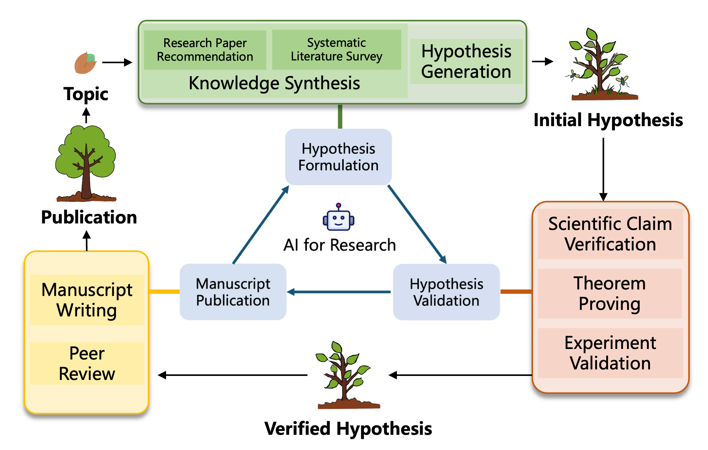
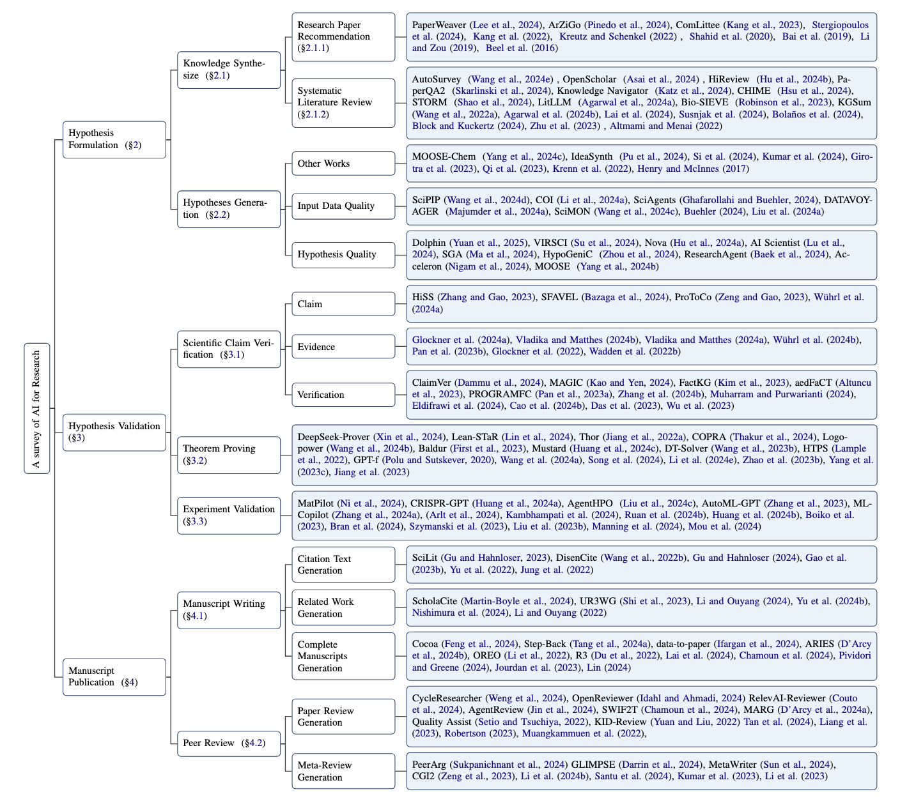
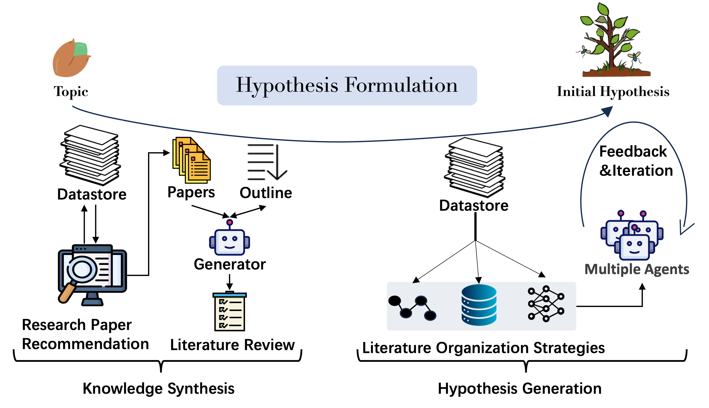
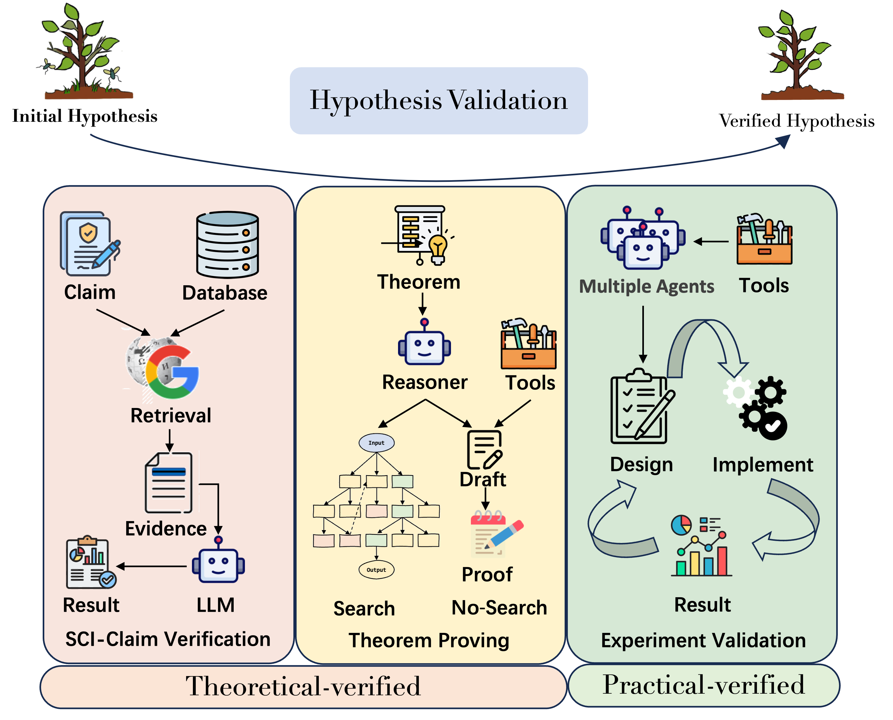
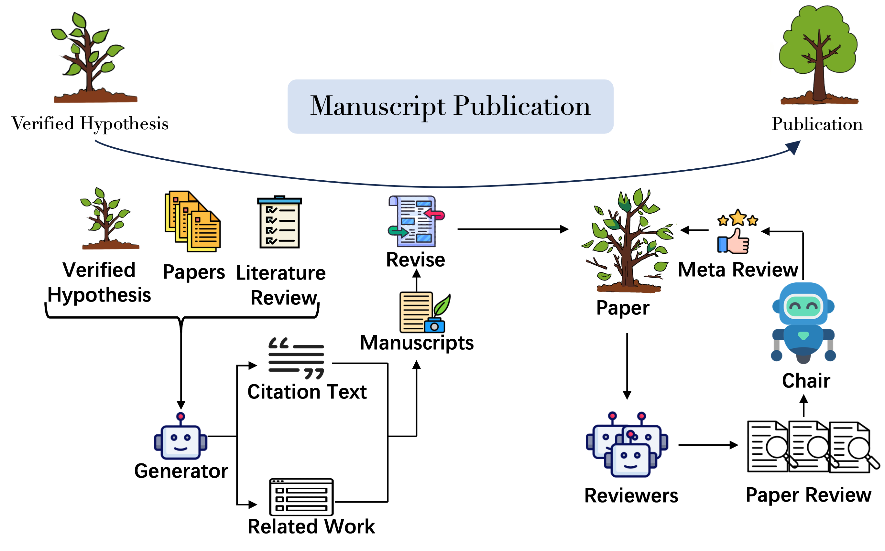
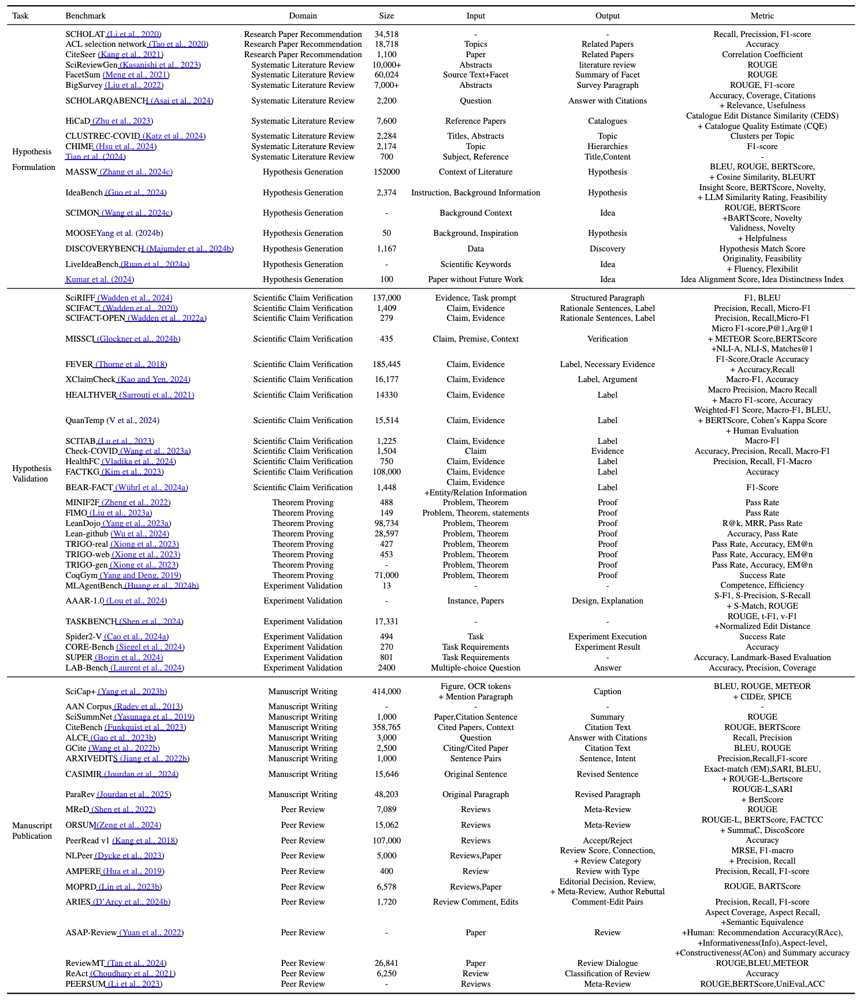

<div align="center">
<h2>
From Hypothesis to Publication: A Comprehensive Survey of AI-Driven Research Support Systems
</h2>
</div>

<div align="center">
<b>Zekun Zhou</b><sup>1</sup>,
<b>Xiaocheng Feng</b><sup>1†,2</sup>,
<b>Lei Huang</b><sup>1</sup>,
<b>Xiachong Feng</b><sup>3</sup>,
<b>Ziyun Song</b><sup>1</sup>,
<b>Ruihan Chen</b><sup>1</sup>,
<b>Liang Zhao</b><sup>1</sup>,
<b>Weitao Ma</b><sup>1</sup>,
<b>Yuxuan Gu</b><sup>1</sup>,
<b>Baoxin Wang</b><sup>4</sup>,
<b>Dayong Wu</b><sup>4</sup>,
<b>Guoping Hu</b><sup>4</sup>,
<b>Ting Liu</b><sup>1,2</sup>,
<b>Bing Qin</b><sup>1,2</sup>
</div>

<div align="center">
<sup>1</sup>Harbin Institute of Technology, Harbin, China &nbsp
<sup>2</sup>Peng Cheng Laboratory, Shenzhen, China
</div>
<div align="center">
<sup>3</sup>The University of Hong Kong, China &nbsp
<sup>4</sup>iFLYTEK Research, China
</div>

<br />


<div align="center">
    <a href="https://arxiv.org/abs/2503.01424"></a>
    <a href="https://github.com/zchuz/CoT-Reasoning-Survey"></a>
    <a href="https://github.com/zkzhou126/AI-for-Research/blob/main/LICENSE">  </a>
</div>

This repository contains the resources for paper **_From Hypothesis to Publication: A Comprehensive Survey of AI-Driven Research Support Systems_**, including **related papers**, **benchmarks**, and **tools** that can accelerate research.





For more details, please refer to the paper: [From Hypothesis to Publication: A Comprehensive Survey of AI-Driven Research Support Systems](https://arxiv.org/abs/2503.01424). We will update the new papers on arXiv cs.CL every Monday!


## 🎉 Updates

- 2025/03/03 Paper is available on [arxiv](https://arxiv.org/abs/2503.01424).
- 2025/03/02 We created this reading list repository.


## 🎁 Resources

### Backgrounds
- **Could AI help you to write your next paper?** Nature 2022, [[paper](https://www.nature.com/articles/d41586-022-03479-w)]
- **Algorithmic ghost in the research shell: Large language models and academic knowledge creation in management research**, arXiv.2303.07304, [[paper]({https://doi.org/10.48550/arXiv.2303.07304)]
- **Scientists' Perspectives on the Potential for Generative AI in their Fields**, arXiv.2304.01420, [[paper]({https://doi.org/10.48550/arXiv.2304.01420)]
- **Friend or foe? Exploring the implications of large language models on the science system**, arXiv.2306.09928, [[paper](https://doi.org/10.48550/arXiv.2306.09928)]
- **An Interdisciplinary Outlook on Large Language Models for Scientific Research**, arXiv.2311.04929 [[paper](https://doi.org/10.48550/arXiv.2311.04929)]
- **Artificial intelligence and illusions of understanding in scientific research**, Nature 2024, [[paper](https://www.nature.com/articles/s41586-024-07146-0)]
- **Monitoring ai-modified content at scale: A case study on the impact of chatgpt on ai conference peer reviews**, ICML 2024,  [[paper](https://openreview.net/forum?id=bX3J7ho18S)]
- **Mapping the increasing use of LLMs in scientific papers**, arXiv.2404.01268, [[paper](https://doi.org/10.48550/arXiv.2404.01268)]
- **LLMs as Research Tools: A Large Scale Survey of Researchers' Usage and Perceptions**, arXiv.2411.05025, [[paper](https://doi.org/10.48550/arXiv.2411.05025)]


### Surveys

- **LLM4SR: A Survey on Large Language Models for Scientific Research**, arXiv.2501.04306, [[paper](https://doi.org/10.48550/arXiv.2501.04306)]
- **Paper recommender systems: a literature survey**, International Journal on Digital Libraries 2016, [[paper](https://link.springer.com/article/10.1007/s00799-015-0156-0)]
- **Scientific paper recommendation: A survey**, IEEE Access 2019, [[paper](https://doi.org/10.1109/ACCESS.2018.2890388)]
- **A review on personalized academic paper recommendation**, Comput. Inf. Sci 2019, [[paper](https://doi.org/10.5539/cis.v12n1p33)]
- **Insights into relevant knowledge extraction techniques: a comprehensive review**, The Journal of Supercomputing 2019, [[paper](https://link.springer.com/article/10.1007/s11227-019-03009-y)]
- **Scientific paper recommendation systems: a literature review of recent publications**, International journal on digital libraries 2022, [[paper]({https://doi.org/10.1007/s00799-022-00339-w)]
- **An anatomization of research paper recommender system: Overview, approaches and challenges**, Engineering Applications of Artificial Intelligence 2023, [[paper](https://www.sciencedirect.com/science/article/abs/pii/S0952197622006315)]
- **Automatic summarization of scientific articles: A survey**,  Journal of King Saud University-Computer and Information Sciences 2022, [[paper](https://doi.org/10.1016/j.jksuci.2020.04.020)]
- **Artificial intelligence for literature reviews: Opportunities and challenges**, Artificial Intelligence Review 2024, [[paper](https://doi.org/10.1007/s10462-024-10902-3)]
- **Scientific fact-checking: A survey of resources and approaches**, ACL 2023, [[paper](https://doi.org/10.18653/v1/2023.findings-acl.387)]
- **Automated justification production for claim veracity in fact checking: A survey on architectures and approaches**, ACL 2024, [[paper](https://doi.org/10.18653/v1/2024.acl-long.361)]
- **Claim verification in the age of large language models: A survey**, arXiv.2408.14317, [[paper](https://doi.org/10.48550/arXiv.2408.14317)]
- **A survey on deep learning for theorem proving**, arXiv.2404.09939, [[paper](https://doi.org/10.48550/arXiv.2404.09939)]
- **Related work and citation text generation: A survey**, EMNLP 2024, [[paper](https://aclanthology.org/2024.emnlp-main.767)]
- **Automated scholarly paper review: Concepts, technologies, and challenges**, Information fusion 2023, [[paper](https://doi.org/10.1016/j.inffus.2023.101830)]
- **Evaluating the Predictive Capacity of ChatGPT for Academic Peer Review**, arXiv.2411.09763, [[paper](https://doi.org/10.48550/arXiv.2411.09763)]
- **What Can Natural Language Processing Do for Peer Review?**, arXiv.2405.06563, [[paper](https://doi.org/10.48550/arXiv.2405.06563)]
- **Artificial intelligence to support publishing and peer review: A summary and review**, Learned Publishing 2024, [[paper](https://doi.org/10.1002/leap.1570)]
- **Large language models for scientific synthesis, inference and explanation**, arXiv.2310.07984, [[paper](https://doi.org/10.48550/arXiv.2310.07984)]
- **A comprehensive survey of scientific large language models and their applications in scientific discovery**, EMNLP 2024, [[paper](https://aclanthology.org/2024.emnlp-main.498)]
- **Agentic AI for Scientific Discovery: A Survey of Progress, Challenges, and Future Directions**, arXiv.2503.08979, [[paper](https://arxiv.org/abs/2503.08979)]


### Hypothesis Formulation


#### Knowledge Synthesis
##### Research Paper Recommendation
- **From Who You Know to What You Read: Augmenting Scientific Recommendations with Implicit Social Networks**, CHI 2022, [[paper](https://doi.org/10.1145/3491102.3517470)]
- **Comlittee: Literature discovery with personal elected author committees**, CHI 2023, [[paper](https://doi.org/10.1145/3544548.3581371)]
- **ArZiGo: A recommendation system for scientific articles**, Information Systems 2024, [[paper](https://doi.org/10.1016/j.is.2024.102367)]
- **An academic recommender system on large citation data based on clustering, graph modeling and deep learning**, Knowledge and Information Systems 2024, [[paper](https://doi.org/10.1007/s10115-024-02094-7)]
- **Paperweaver: Enriching topical paper alerts by contextualizing recommended papers with user-collected papers**, CHI 2024, [[paper](https://doi.org/10.1145/3613904.3642196)]

##### Systematic Literature Review
- **Multi-document scientific summarization from a knowledge graph-centric view**, COLING 2022, [[paper](https://aclanthology.org/2022.coling-1.543)]
- **Hierarchical catalogue generation for literature review: a benchmark**, EMNLP 2023, [[paper](https://doi.org/10.18653/v1/2023.findings-emnlp.453)]
- **Bio-sieve: exploring instruction tuning large language models for systematic review automation**, arXiv.2308.06610, [[paper](https://doi.org/10.48550/arXiv.2308.06610)]
- **Assisting in writing wikipedia-like articles from scratch with large language models**, NAACL 2024, [[paper](https://doi.org/10.18653/v1/2024.naacl-long.347)]
- **Autosurvey: Large language models can automatically write surveys**, NeurIPS 2024, [[paper](http://papers.nips.cc/paper\_files/paper/2024/hash/d07a9fc7da2e2ec0574c38d5f504d105-Abstract-Conference.html)]
- **Knowledge Navigator: LLM-guided Browsing Framework for Exploratory Search in Scientific Literature**, EMNLP 2024, [[paper](https://aclanthology.org/2024.findings-emnlp.516)]
- **Chime: Llm-assisted hierarchical organization of scientific studies for literature review support**, ACL 2024, [[paper](https://doi.org/10.18653/v1/2024.findings-acl.8)]
- **Instruct Large Language Models to Generate Scientific Literature Survey Step by Step**, NLPCC 2024, [[paper](https://doi.org/10.1007/978-981-97-9443-0\_43)]
- **Hireview: Hierarchical taxonomy-driven automatic literature review generation**, arXiv.2410.03761, [[paper](https://doi.org/10.48550/arXiv.2410.03761)]
- **Language agents achieve superhuman synthesis of scientific knowledge**, arXiv.2409.13740, [[paper](https://doi.org/10.48550/arXiv.2409.13740)]
- **Litllm: A toolkit for scientific literature review**, arXiv.2402.01788, [[paper](https://doi.org/10.48550/arXiv.2402.01788)]
- **LLMs for Literature Review: Are we there yet?**, arXiv.2412.15249, [[paper](https://doi.org/10.48550/arXiv.2412.15249)]
- **Automating research synthesis with domain-specific large language model fine-tuning**, arXiv.2404.08680, [[paper](https://doi.org/10.48550/arXiv.2404.08680)]
- **OpenScholar: Synthesizing Scientific Literature with Retrieval-augmented LMs**, arXiv.2411.14199, [[paper](https://doi.org/10.48550/arXiv.2411.14199)]
- **Agent Laboratory: Using LLM Agents as Research Assistants**, arXiv.2501.04227, [[paper](https://arxiv.org/abs/2501.04227)]
- **SurveyX: Academic Survey Automation via Large Language Models**, arXiv.2502.14776,[[paper](https://arxiv.org/abs/2502.14776)]

##### Other Works
- **What's In Your Field? Mapping Scientific Research with Knowledge Graphs and Large Language Models**, arXiv.2503.09894, [[paper](https://arxiv.org/abs/2503.09894)]


#### Hypothesis Generation
- **Literature based discovery: models, methods, and trends**, Journal of biomedical informatics 2017, [[paper](https://doi.org/10.1016/j.jbi.2017.08.011)]
- **Predicting the Future of AI with AI: High-quality link prediction in an exponentially growing knowledge network**, arXiv.2210.00881, [[paper](https://doi.org/10.48550/arXiv.2210.00881)]
- **Ideas are dimes a dozen: Large language models for idea generation in innovation**, The Wharton School Research Paper Forthcoming 2023, [[paper](https://christophegirard.com/wp-content/uploads/2023/09/Etude-creation-idees-comparative-ChatGPT-vs-etudiants.pdf)]
- **Can LLMs Generate Novel Research Ideas? A Large-Scale Human Study with 100+ NLP Researchers**, arXiv.2409.04109, [[paper](https://doi.org/10.48550/arXiv.2409.04109)]
- **Can Large Language Models Unlock Novel Scientific Research Ideas?**, arXiv.2409.06185, [[paper](https://doi.org/10.48550/arXiv.2409.06185)]
- **MOOSE-Chem: Large Language Models for Rediscovering Unseen Chemistry Scientific Hypotheses**, arXiv.2410.07076, [[paper](https://doi.org/10.48550/arXiv.2410.07076)]
- **IdeaSynth: Iterative Research Idea Development Through Evolving and Composing Idea Facets with Literature-Grounded Feedback**, arXiv.2410.04025, [[paper](https://doi.org/10.48550/arXiv.2410.04025)]
- **Data-driven discovery with large generative models**, ICML 2024, [[paper](https://openreview.net/forum?id=5SpjhZNXtt)]
- **DiscoveryWorld: A Virtual Environment for Developing and Evaluating Automated Scientific Discovery Agents**, NeurIPS 2024,[[paper](http://papers.nips.cc/paper\_files/paper/2024/hash/13836f251823945316ae067350a5c366-Abstract-Datasets\_and\_Benchmarks\_Track.html)]
- **Literature meets data: A synergistic approach to hypothesis generation**, arXiv.2410.17309, [[paper](https://doi.org/10.48550/arXiv.2410.17309)]
- **SciMON: Scientific Inspiration Machines Optimized for Novelty**, ACL 2024, [[paper](https://doi.org/10.18653/v1/2024.acl-long.18)]
- **Chain of ideas: Revolutionizing research via novel idea development with llm agents**, arXiv.2410.13185, [[paper](https://doi.org/10.48550/arXiv.2410.13185)]
- **SciPIP: An LLM-based Scientific Paper Idea Proposer**, arXiv.2410.23166, [[paper](https://doi.org/10.48550/arXiv.2410.23166)]
- **Accelerating scientific discovery with generative knowledge extraction, graph-based representation, and multimodal intelligent graph reasoning**, Machine Learning: Science and Technology 2024, [[paper](https://doi.org/10.1088/2632-2153/ad7228)]
- **Sciagents: Automating scientific discovery through multi-agent intelligent graph reasoning**, arXiv.2409.05556, [[paper](https://doi.org/10.48550/arXiv.2409.05556)]
- **Generation and human-expert evaluation of interesting research ideas using knowledge graphs and large language models**, arXiv.2405.17044, [[paper](https://doi.org/10.48550/arXiv.2405.17044)]
- **Hypothesis generation with large language models**, arXiv.2404.04326, [[paper](https://doi.org/10.48550/arXiv.2404.04326)]
- **Large language models for automated open-domain scientific hypotheses discovery**, ACL 2024, [[paper](https://doi.org/10.18653/v1/2024.findings-acl.804)]
- **Researchagent: Iterative research idea generation over scientific literature with large language models**, arXiv.2404.07738, [[paper](https://doi.org/10.48550/arXiv.2404.07738)]
- **LLM and Simulation as Bilevel Optimizers: A New Paradigm to Advance Physical Scientific Discovery**, ICML 2024, [[paper](https://openreview.net/forum?id=hz8cFsdz7P)]
- **The AI Scientist: Towards Fully Automated Open-Ended Scientific Discovery**, arXiv.2408.06292, [[paper](https://doi.org/10.48550/arXiv.2408.06292)]
- **Acceleron: A tool to accelerate research ideation**, arXiv.2403.04382, [[paper](https://doi.org/10.48550/arXiv.2403.04382)]
- **Sciagents: Automating scientific discovery through multi-agent intelligent graph reasoning**, arXiv.2409.05556, [[paper](https://doi.org/10.48550/arXiv.2409.05556)]
- **Two heads are better than one: A multi-agent system has the potential to improve scientific idea generation**, arXiv.2410.09403, [[paper](https://doi.org/10.48550/arXiv.2410.09403)]
- **Nova: An iterative planning and search approach to enhance novelty and diversity of llm generated ideas**, arXiv.2410.14255, [[paper](https://doi.org/10.48550/arXiv.2410.14255)]
- **Learning to Generate Research Idea with Dynamic Control**, arXiv.2412.14626, [[paper](https://doi.org/10.48550/arXiv.2412.14626)]
- **ResearchTown: Simulator of Human Research Community**, arXiv.2412.17767,[[paper](https://doi.org/10.48550/arXiv.2412.17767)]
- **Dolphin: Closed-loop Open-ended Auto-research through Thinking, Practice, and Feedback**, arXiv.2501.03916, [[paper](https://doi.org/10.48550/arXiv.2501.03916)]
- **Towards an AI co-scientist**, arXiv.2502.18864,[[paper](https://arxiv.org/pdf/2502.18864)]
- **Graph of AI Ideas: Leveraging Knowledge Graphs and LLMs for AI Research Idea Generation**, arXiv.2503.08549, [[paper](https://arxiv.org/abs/2503.08549)]

### Hypothesis Validation


#### Scientific Claim Verification
- **Fact or fiction: Verifying scientific claims**, EMNLP 2020, [[paper](https://doi.org/10.18653/v1/2020.emnlp-main.609)]
- **Generating fact checking explanations**, ACL 2020, [[paper](https://doi.org/10.18653/v1/2020.acl-main.656)]
- **Missing counter-evidence renders NLP fact-checking unrealistic for misinformation**, EMNLP 2022, [[paper](https://doi.org/10.18653/v1/2022.emnlp-main.397)]
- **MultiVerS: Improving scientific claim verification with weak supervision and full-document context**, NAACL 2022, [[paper](https://doi.org/10.18653/v1/2022.findings-naacl.6)]
- **Proofver: Natural logic theorem proving for fact verification**, TACL 2022, [[paper](https://doi.org/10.1162/tacl\_a\_00503)]
- **Fact-checking complex claims with program-guided reasoning**, ACL 2023, [[paper](https://doi.org/10.18653/v1/2023.acl-long.386)]
- **FactKG: Fact verification via reasoning on knowledge graphs**, ACL 2023, [[paper](https://doi.org/10.18653/v1/2023.acl-long.895)]
- **Prompt to be Consistent is Better than Self-Consistent? Few-Shot and Zero-Shot Fact Verification with Pre-trained Language Models**, ACL 2023, [[paper](https://doi.org/10.18653/v1/2023.findings-acl.278)]
- **Towards LLM-based Fact Verification on News Claims with a Hierarchical Step-by-Step Prompting Method**, IJCNLP 2023, [[paper](https://doi.org/10.18653/v1/2023.ijcnlp-main.64)]
- **Investigating zero-and few-shot generalization in fact verification**, IJCNLP 2023, [[paper](https://doi.org/10.18653/v1/2023.ijcnlp-main.34)]
- **The state of human-centered NLP technology for fact-checking**, Information processing & management 2023, [[paper](https://doi.org/10.1016/j.ipm.2022.103219)]
- **Characterizing and Verifying Scientific Claims: Qualitative Causal Structure is All You Need**, EMNLP  2023, [[paper](https://doi.org/10.18653/v1/2023.emnlp-main.828)]
- **aedFaCT: Scientific Fact-Checking Made Easier via Semi-Automatic Discovery of Relevant Expert Opinions**, arXiv.2305.07796, [[paper](https://doi.org/10.48550/arXiv.2305.07796)]
- **What Makes Medical Claims (Un)Verifiable? Analyzing Entity and Relation Properties for Fact Verification**, ACL 2024, [[paper](https://aclanthology.org/2024.eacl-long.124)]
- **Unsupervised Pretraining for Fact Verification by Language Model Distillation**, ICLR 2024, [[paper](https://openreview.net/forum?id=1mjsP8RYAw)]
- **Comparing knowledge sources for open-domain scientific claim verification**, EACL 2024, [[paper](https://aclanthology.org/2024.eacl-long.128)]
- **Improving health question answering with reliable and time-aware evidence retrieval**, NAACL 2024, [[paper](https://doi.org/10.18653/v1/2024.findings-naacl.295)]
- **MAGIC: Multi-Argument Generation with Self-Refinement for Domain Generalization in Automatic Fact-Checking**, COLING 2024, [[paper](https://aclanthology.org/2024.lrec-main.951)]
- **Understanding Fine-grained Distortions in Reports of Scientific Findings**, ACL 2024, [[paper](https://doi.org/10.18653/v1/2024.findings-acl.369)]
- **ClaimVer: Explainable claim-level verification and evidence attribution of text through knowledge graphs**, EMNLP 2024, [[paper](https://aclanthology.org/2024.findings-emnlp.795)]
- **Grounding fallacies misrepresenting scientific publications in evidence**, arXiv.2408.12812, [[paper](https://doi.org/10.48550/arXiv.2408.12812)]
- **Can Large Language Models Detect Misinformation in Scientific News Reporting?**, arXiv.2402.14268, [[paper](https://doi.org/10.48550/arXiv.2402.14268)]
- **Enhancing natural language inference performance with knowledge graph for COVID-19 automated fact-checking in Indonesian language**, arXiv.2409.00061, [[paper](https://doi.org/10.48550/arXiv.2409.00061)]
- **Augmenting the Veracity and Explanations of Complex Fact Checking via Iterative Self-Revision with LLMs**, arXiv.2410.15135, [[paper](https://doi.org/10.48550/arXiv.2410.15135)]

#### Theorem Proving
- **Generative language modeling for automated theorem proving**, arXiv.2009.03393, [[paper](https://arxiv.org/abs/2009.03393)]
- **HyperTree Proof Search for Neural Theorem Proving**, NeurIPS 2022, [[paper](http://papers.nips.cc/paper\_files/paper/2022/hash/a8901c5e85fb8e1823bbf0f755053672-Abstract-Conference.html)]
- **Thor: Wielding hammers to integrate language models and automated theorem provers**, NeurIPS 2022, [[paper](http://papers.nips.cc/paper\_files/paper/2022/hash/377c25312668e48f2e531e2f2c422483-Abstract-Conference.html)]
- **Draft, sketch, and prove: Guiding formal theorem provers with informal proofs**, ICLR  2023, [[paper](https://openreview.net/forum?id=SMa9EAovKMC)]
- **Dt-solver: Automated theorem proving with dynamic-tree sampling guided by proof-level value function**, ACL 2023, [[paper](https://doi.org/10.18653/v1/2023.acl-long.706)]
- **Baldur: Whole-proof generation and repair with large language models**, ESEC/FSE 2023, [[paper](https://doi.org/10.1145/3611643.3616243)]
- **An in-context learning agent for formal theorem-proving**, arXiv.2310.04353, [[paper](https://doi.org/10.48550/arXiv.2310.04353)]
- **Decomposing the enigma: Subgoal-based demonstration learning for formal theorem proving**, arXiv.2305.16366, [[paper](https://doi.org/10.48550/arXiv.2305.16366)]
- **Proving theorems recursively**, NeurIPS 2024, [[paper](http://papers.nips.cc/paper\_files/paper/2024/hash/9de7a49945898da86e062e7029baa284-Abstract-Conference.html)]
- **Lean-star: Learning to interleave thinking and proving**, arXiv.2407.10040, [[paper](https://doi.org/10.48550/arXiv.2407.10040)]
- **Lego-prover: Neural theorem proving with growing libraries**, ICLR 2024, [[paper](https://openreview.net/forum?id=3f5PALef5B)]
- **Mustard: Mastering uniform synthesis of theorem and proof data**, ICLR 2024, [[paper](https://openreview.net/forum?id=8xliOUg9EW)]
- **Deepseek-prover: Advancing theorem proving in llms through large-scale synthetic data**, arXiv.2405.14333, [[paper](https://doi.org/10.48550/arXiv.2405.14333)]
- **Towards large language models as copilots for theorem proving in lean**, arXiv.2404.12534, [[paper](https://doi.org/10.48550/arXiv.2404.12534)]

#### Experiment Validation
- **Autonomous chemical research with large language models**, Nature 2023 [[paper](https://doi.org/10.1038/s41586-023-06792-0)]
- **An autonomous laboratory for the accelerated synthesis of novel materials**, Nature 2023, [[paper](https://www.nature.com/articles/s41586-023-06734-w)]
- **Automl-gpt: Automatic machine learning with gpt**, arXiv.2305.02499, [[paper](https://doi.org/10.48550/arXiv.2305.02499)]
- **MechAgents: Large language model multi-agent collaborations can solve mechanics problems, generate new data, and integrate knowledge**, arXiv.2311.08166, [[paper](https://doi.org/10.48550/arXiv.2311.08166)]
- **Position: LLMs can't plan, but can help planning in LLM-modulo frameworks**, ICML 2024, [[paper](https://openreview.net/forum?id=Th8JPEmH4z)]
- **An automatic end-to-end chemical synthesis development platform powered by large language models**, Nature communications 2024, [[paper](https://doi.org/10.1038/s41467-024-54457-x)]
- **Mlcopilot: Unleashing the power of large language models in solving machine learning tasks**, EACL 2024, [[paper](https://aclanthology.org/2024.eacl-long.179)]
- **Meta-Designing Quantum Experiments with Language Models**, arXiv.2406.02470, [[paper](https://doi.org/10.48550/arXiv.2406.02470)]
- **Augmenting large language models with chemistry tools**, Nature Machine Intelligence 2024, [[paper](https://doi.org/10.1038/s42256-024-00832-8)]
- **Crispr-gpt: An llm agent for automated design of gene-editing experiments**, arXiv.2404.18021, [[paper](https://doi.org/10.48550/arXiv.2404.18021)]
- **Chain of ideas: Revolutionizing research via novel idea development with llm agents**, arXiv.2410.13185, [[paper](https://doi.org/10.48550/arXiv.2410.13185)]
- **The AI Scientist: Towards Fully Automated Open-Ended Scientific Discovery**, arXiv.2408.06292, [[paper](https://doi.org/10.48550/arXiv.2408.06292)]
- **Large language model agent for hyper-parameter optimization**, arXiv.2402.01881, [[paper](https://doi.org/10.48550/arXiv.2402.01881)]
- **MatPilot: an LLM-enabled AI Materials Scientist under the Framework of Human-Machine Collaboration**, arXiv.2411.08063, [[paper](https://doi.org/10.48550/arXiv.2411.08063)]
- **Mlr-copilot: Autonomous machine learning research based on large language models agents**, arXiv.2408.14033, [[paper](https://doi.org/10.48550/arXiv.2408.14033)]
- **Researchagent: Iterative research idea generation over scientific literature with large language models**, arXiv.2404.07738, [[paper](https://doi.org/10.48550/arXiv.2404.07738)]
- **Training socially aligned language models on simulated social interactions**, ICLR 2024, [[paper](https://openreview.net/forum?id=NddKiWtdUm)]
- **Automated social science: Language models as scientist and subjects**, arXiv.2404.11794, [[paper](https://arxiv.org/abs/2404.11794)]
- **AAAR-1.0: Assessing AI's Potential to Assist Research**, arXiv.2410.22394, [[paper](https://doi.org/10.48550/arXiv.2410.22394)]
- **Dolphin: Closed-loop Open-ended Auto-research through Thinking, Practice, and Feedback**, arXiv.2501.03916, [[paper](https://doi.org/10.48550/arXiv.2501.03916)]
- **Agent Laboratory: Using LLM Agents as Research Assistants**, arXiv.2501.04227, [[paper](https://arxiv.org/abs/2501.04227)]

### Manuscript Publication

#### Manuscript Writing
- **Disencite: Graph-based disentangled representation learning for context-specific citation generation**, AAAI 2022, [[paper](https://doi.org/10.1609/aaai.v36i10.21397)]
- **Intent-controllable citation text generation**, Mathematics 2022, [[paper](https://www.mdpi.com/2227-7390/10/10/1763)]
- **Understanding Iterative Revision from Human-Written Text**, ACL 2022, [[paper](https://aclanthology.org/2022.acl-long.250/)]
- **Improving Iterative Text Revision by Learning Where to Edit from Other Revision Tasks**, EMNLP 2022, [[paper](https://aclanthology.org/2022.emnlp-main.678/)]
- **Controllable citation sentence generation with language models**, arXiv.2211.07066, [[paper](https://arxiv.org/abs/2211.07066)]
- **Read, revise, repeat: A system demonstration for human-in-the-loop iterative text revision**, arXiv.2204.03685, [[paper](https://doi.org/10.48550/arXiv.2204.03685)]
- **Enabling large language models to generate text with citations**, EMNLP 2023, [[paper](https://doi.org/10.18653/v1/2023.emnlp-main.398)]
- **Towards a unified framework for reference retrieval and related work generation**, EMNLP 2023, [[paper](https://doi.org/10.18653/v1/2023.findings-emnlp.385)]
- **SciLit: A platform for joint scientific literature discovery, summarization and citation generation**, ACL 2023, [[paper](https://doi.org/10.18653/v1/2023.acl-demo.22)]
- **Exploring the boundaries of reality: investigating the phenomenon of artificial intelligence hallucination in scientific writing through ChatGPT references**, Cureus 2023, [[paper](https://pubmed.ncbi.nlm.nih.gov/37182055/)]
- **Can artificial intelligence help for scientific writing?**, Critical care 2023, [[paper](https://ccforum.biomedcentral.com/articles/10.1186/s13054-023-04380-2)]
- **Decoding the End-to-end Writing Trajectory in Scholarly Manuscripts**, In2Writing @CHI 2023, [[paper](https://arxiv.org/abs/2304.00121)]
- **Text revision in scientific writing assistance: An overview**, arXiv.2303.16726, [[paper](https://doi.org/10.48550/arXiv.2303.16726)]
- **Text revision by on-the-fly representation optimization**, arXiv.2303.16726, [[paper](https://doi.org/10.48550/arXiv.2303.16726)]
- **A publishing infrastructure for Artificial Intelligence (AI)-assisted academic authoring**, JAMIA 2024, [[paper](https://doi.org/10.1093/jamia/ocae139)]
- **Automated focused feedback generation for scientific writing assistance**, ACL 2024, [[paper](https://doi.org/10.18653/v1/2024.findings-acl.580)]
- **Aries: A corpus of scientific paper edits made in response to peer reviews**, ACL 2024, [[paper](https://doi.org/10.18653/v1/2024.acl-long.377)]
- **Reinforced Subject-Aware Graph Neural Network for Related Work Generation**, KSEM 2024, [[paper](https://doi.org/10.1007/978-981-97-5492-2\_16)]
- **Toward Structured Related Work Generation with Novelty Statements**, SDP 2024, [[paper](https://aclanthology.org/2024.sdp-1.5/)]
- **Instruct Large Language Models to Generate Scientific Literature Survey Step by Step**, NLPCC 2024, [[paper](https://doi.org/10.1007/978-981-97-9443-0\_43)]
- **Techniques for supercharging academic writing with generative AI**, Nature Biomedical Engineering 2024, [[paper](https://www.nature.com/articles/s41551-024-01185-8)]
- **Reference hallucination score for medical artificial intelligence chatbots: development and usability study**, JMIR Medical Informatics 2024, [[paper](https://medinform.jmir.org/2024/1/e54345)]
- **Shallow synthesis of knowledge in gpt-generated texts: A case study in automatic related work composition**, arXiv.2402.12255, [[paper](https://doi.org/10.48550/arXiv.2402.12255)]
- **The AI Scientist: Towards Fully Automated Open-Ended Scientific Discovery**, arXiv.2408.06292, [[paper](https://doi.org/10.48550/arXiv.2408.06292)]
- **Cocoa: Co-Planning and Co-Execution with AI Agents**, arXiv.2412.10999, [[paper](https://doi.org/10.48550/arXiv.2412.10999)]
- **ResearchTown: Simulator of Human Research Community**, arXiv.2412.17767,[[paper](https://doi.org/10.48550/arXiv.2412.17767)]
- **Autonomous LLM-Driven Research—from Data to Human-Verifiable Research Papers**, arXiv.2404.17605, [[paper](https://doi.org/10.48550/arXiv.2404.17605)]
- **Step-Back Profiling: Distilling User History for Personalized Scientific Writing**, arXiv.2406.14275, [[paper](https://doi.org/10.48550/arXiv.2406.14275)]
- **Agent Laboratory: Using LLM Agents as Research Assistants**, arXiv.2501.04227, [[paper](https://arxiv.org/abs/2501.04227)]


#### Peer Review
- **Exploiting Labeled and Unlabeled Data via Transformer Fine-tuning for Peer-Review Score Prediction**, EMNLP 2022, [[paper](https://doi.org/10.18653/v1/2022.findings-emnlp.164)]
- **Can We Automate Scientific Reviewing?**, JAIR 2022, [[paper](https://doi.org/10.1613/jair.1.12862)]
- **The Quality Assist: A Technology-Assisted Peer Review Based on Citation Functions to Predict the Paper Quality**, IEEE Access 2022, [[paper](https://doi.org/10.1109/ACCESS.2022.3225871)]
- **KID-Review: Knowledge-Guided Scientific Review Generation with Oracle Pre-training**, AAAI 2022, [[paper](https://doi.org/10.1609/aaai.v36i10.21418)]
- **Summarizing Multiple Documents with Conversational Structure for Meta-Review Generation**, EMNLP 2023, [[paper](https://doi.org/10.18653/v1/2023.findings-emnlp.472)]
- **When Reviewers Lock Horn: Finding Disagreement in Scientific Peer Reviews**, EMNLP 2023, [[paper](https://doi.org/10.18653/v1/2023.emnlp-main.1038)]
- **Gpt4 is slightly helpful for peer-review assistance: A pilot study**, arXiv.2307.05492, [[paper](https://doi.org/10.48550/arXiv.2307.05492)]
- **ReviewerGPT? An Exploratory Study on Using Large Language Models for Paper Reviewing**, arXiv.2306.00622, [[paper](https://doi.org/10.48550/arXiv.2306.00622)]
- **Unveiling the Sentinels: Assessing AI Performance in Cybersecurity Peer Review**, arXiv.2309.05457, [[paper](https://doi.org/10.48550/arXiv.2309.05457)]
- **Can large language models provide useful feedback on research papers**, arXiv.2310.01783, [[paper](https://doi.org/10.48550/arXiv.2310.01783)]
- **Scientific Opinion Summarization: Meta-review Generation with Checklist-guided Iterative Introspection**, arXiv.2305.14647, [[paper](https://doi.org/10.48550/arXiv.2305.14647)]
- **MetaWriter: Exploring the Potential and Perils of AI Writing Support in Scientific Peer Review**, PACMHCI 2024, [[paper](https://doi.org/10.1145/3637371)]
- **GLIMPSE: Pragmatically Informative Multi-Document Summarization for Scholarly Reviews**, ACL 2024, [[paper](https://doi.org/10.18653/v1/2024.acl-long.688)]
- **Automated Focused Feedback Generation for Scientific Writing Assistance**, ACL 2024, [[paper](https://doi.org/10.18653/v1/2024.findings-acl.580)]
- **AgentReview: Exploring Peer Review Dynamics with LLM Agents**, EMNLP 2024, [[paper](https://aclanthology.org/2024.emnlp-main.70)]
- **A sentiment consolidation framework for meta-review generation**, ACL 2024, [[paper](https://doi.org/10.18653/v1/2024.acl-long.547)]
- **Human-in-the-loop AI reviewing: Feasibility, opportunities, and risks**, JAIS 2024, [[paper](https://aisel.aisnet.org/jais/vol25/iss1/7/)]
- **RelevAI-Reviewer: A Benchmark on AI Reviewers for Survey Paper Relevance**, arXiv.2406.10294, [[paper](https://doi.org/10.48550/arXiv.2406.10294)]
- **The AI Scientist: Towards Fully Automated Open-Ended Scientific Discovery**, arXiv.2408.06292, [[paper](https://doi.org/10.48550/arXiv.2408.06292)]
- **MARG: Multi-Agent Review Generation for Scientific Papers**, arXiv.2401.04259, [[paper](https://doi.org/10.48550/arXiv.2401.04259)]
- **Peer Review as A Multi-Turn and Long-Context Dialogue with Role-Based Interactions**, arXiv.2406.05688, [[paper](https://doi.org/10.48550/arXiv.2406.05688)]
- **CycleResearcher: Improving Automated Research via Automated Review**, arXiv.2411.00816, [[paper](https://doi.org/10.48550/arXiv.2411.00816)]
- **OpenReviewer: A Specialized Large Language Model for Generating Critical Scientific Paper Reviews**, arXiv.2412.11948, [[paper](https://doi.org/10.48550/arXiv.2412.11948)]
- **Prompting LLMs to Compose Meta-Review Drafts from Peer-Review Narratives of Scholarly Manuscripts**, arXiv.2402.15589, [[paper](https://doi.org/10.48550/arXiv.2402.15589)]
- **PeerArg: Argumentative Peer Review with LLMs**, arXiv.2409.16813, [[paper](https://doi.org/10.48550/arXiv.2409.16813)]
- **ResearchTown: Simulator of Human Research Community**, arXiv.2412.17767,[[paper](https://doi.org/10.48550/arXiv.2412.17767)]
- **ReviewAgents: Bridging the Gap Between Human and AI-Generated Paper Reviews**, arXiv.2503.08506, [[paper](https://arxiv.org/abs/2503.08506)]
- **DeepReview: Improving LLM-based Paper Review with Human-like Deep Thinking Process**, arXiv.2503.08569, [[paper](https://arxiv.org/abs/2503.08569)]


## 💯 Benchmarks

### Research Paper Recommendation
- **Academic Paper Recommendation Method Combining Heterogeneous Network and Temporal Attributes**, CCSCW 2020, [[paper](https://doi.org/10.1007/978-981-16-2540-4\_33)]
- **Paper recommend based on LDA and PageRank**, ICAIS 2020, [[paper](https://link.springer.com/chapter/10.1007/978-981-15-8101-4_51)]
- **A hybrid approach for paper recommendation**,  IEICE TRANS 2021, [[paper](https://search.ieice.org/bin/summary.php?id=e104-d_8_1222)]

### Systematic Literature Review
- **Bringing structure into summaries: a faceted summarization dataset for long scientific documents**, ACL/IJCNLP 2021, [[paper]({https://doi.org/10.18653/v1/2021.acl-short.137)]
- **Generating a structured summary of numerous academic papers: Dataset and method**, IJCAI 2022, [[paper](https://doi.org/10.24963/ijcai.2022/591)]
- **SciReviewGen: a large-scale dataset for automatic literature review generation**, ACL 2023, [[paper](https://doi.org/10.18653/v1/2023.findings-acl.418)]
- **Hierarchical catalogue generation for literature review: a benchmark**, EMNLP 2023, [[paper](https://doi.org/10.18653/v1/2023.findings-emnlp.453)]
- **Knowledge Navigator: LLM-guided Browsing Framework for Exploratory Search in Scientific Literature**, EMNLP 2024, [[paper](https://aclanthology.org/2024.findings-emnlp.516)]
- **CHIME: LLM-Assisted Hierarchical Organization of Scientific Studies for Literature Review Support**, ACL 2024, [[paper](https://doi.org/10.18653/v1/2024.findings-acl.8)]
- **Overview of the NLPCC2024 Shared Task 6: Scientific Literature Survey Generation**, NLPCC 2024, [[paper](https://doi.org/10.1007/978-981-97-9443-0\_35)]
- **OpenScholar: Synthesizing Scientific Literature with Retrieval-augmented LMs**, arXiv.2411.14199, [[paper](https://doi.org/10.48550/arXiv.2411.14199)]

### Hypothesis Generation
- **SciMON: Scientific Inspiration Machines Optimized for Novelty**, ACL 2024, [[paper](https://doi.org/10.18653/v1/2024.acl-long.18)]
- **Large Language Models for Automated Open-domain Scientific Hypotheses Discovery**, ACL 2024, [[paper](https://doi.org/10.18653/v1/2024.findings-acl.804)]
- **MASSW: A new dataset and benchmark tasks for ai-assisted scientific workflows**, arXiv.2406.06357, [[paper](https://doi.org/10.48550/arXiv.2406.06357)]
- **DiscoveryBench: Towards Data-Driven Discovery with Large Language Models**, arXiv.2407.01725, [[paper](https://doi.org/10.48550/arXiv.2407.01725)]
- **Can Large Language Models Unlock Novel Scientific Research Ideas?**, arXiv.2409.06185, [[paper](https://doi.org/10.48550/arXiv.2409.06185)]
- **IdeaBench: Benchmarking Large Language Models for Research Idea Generation**, arXiv.2411.02429, [[paper](https://doi.org/10.48550/arXiv.2411.02429)]
- **LiveIdeaBench: Evaluating LLMs' Scientific Creativity and Idea Generation with Minimal Context**, arXiv.2412.17596, [[paper](https://doi.org/10.48550/arXiv.2412.17596)]

### Scientific Claim Verification
- **FEVER: a Large-scale Dataset for Fact Extraction and VERification**, NAACL-HLT 2018, [[paper]({https://doi.org/10.18653/v1/n18-1074)]
- **Fact or fiction: Verifying scientific claims**, EMNLP 2020, [[paper](https://doi.org/10.18653/v1/2020.emnlp-main.609)]
- **Evidence-based Fact-Checking of Health-related Claims**, EMNLP 2021, [[paper](https://doi.org/10.18653/v1/2021.findings-emnlp.297)]
- **SciFact-Open: Towards open-domain scientific claim verification**, EMNLP 2022, [[paper](https://doi.org/10.18653/v1/2022.findings-emnlp.347)]
- **SCITAB: A Challenging Benchmark for Compositional Reasoning and Claim Verification on Scientific Tables**, EMNLP 2023, [[paper](https://doi.org/10.18653/v1/2023.emnlp-main.483)]
- **Check-COVID: Fact-Checking COVID-19 News Claims with Scientific Evidence**, ACL 2023, [[paper](https://doi.org/10.18653/v1/2023.findings-acl.888)]
- **FactKG: Fact Verification via Reasoning on Knowledge Graphs**, ACL 2023, [[paper](https://doi.org/10.18653/v1/2023.acl-long.895)]
- **Missci: Reconstructing Fallacies in Misrepresented Science**, ACL 2024, [[paper](https://doi.org/10.18653/v1/2024.acl-long.240)]
- **MAGIC: Multi-Argument Generation with Self-Refinement for Domain Generalization in Automatic Fact-Checking**, LREC/COLING 2024, [[paper](https://aclanthology.org/2024.lrec-main.951)]
- **QuanTemp: A real-world open-domain benchmark for fact-checking numerical claims**, SIGIR 2024, [[paper](https://doi.org/10.1145/3626772.3657874)]
- **HealthFC: Verifying Health Claims with Evidence-Based Medical Fact-Checking**, LREC/COLING 2024, [[paper](https://aclanthology.org/2024.lrec-main.709)]
- **What Makes Medical Claims (Un)Verifiable? Analyzing Entity and Relation Properties for Fact Verification**, EACL 2024, [[paper](https://aclanthology.org/2024.eacl-long.124)]
- **Sciriff: A resource to enhance language model instruction-following over scientific literature**, arXiv.2406.07835, [[paper](https://doi.org/10.48550/arXiv.2406.07835)]

### Theorem Proving
- **Learning to Prove Theorems via Interacting with Proof Assistants**, ICML 2019, [[paper](http://proceedings.mlr.press/v97/yang19a.html)]
- **miniF2F: a cross-system benchmark for formal Olympiad-level mathematics**, ICLR 2022, [[paper](https://openreview.net/forum?id=9ZPegFuFTFv)]
- **LeanDojo: Theorem Proving with Retrieval-Augmented Language Models**, NeurIPS 2023, [[paper](http://papers.nips.cc/paper\_files/paper/2023/hash/4441469427094f8873d0fecb0c4e1cee-Abstract-Datasets\_and\_Benchmarks.html)]
- **TRIGO: Benchmarking Formal Mathematical Proof Reduction for Generative Language Models**, EMNLP 2023, [[paper](https://doi.org/10.18653/v1/2023.emnlp-main.711)]
- **FIMO: A Challenge Formal Dataset for Automated Theorem Proving**, arXiv.2309.04295, [[paper](https://doi.org/10.48550/arXiv.2309.04295)]
- **LEAN-GitHub: Compiling GitHub LEAN repositories for a versatile LEAN prover**, arXiv.2407.17227, [[paper](https://doi.org/10.48550/arXiv.2407.17227)]

### Experiment Validation
- **MLAgentBench: Evaluating Language Agents on Machine Learning Experimentation**, ICML 2024, [[paper](https://openreview.net/forum?id=1Fs1LvjYQW)]
- **TaskBench: Benchmarking Large Language Models for Task Automation**, NeurIPS 2024, [[paper](http://papers.nips.cc/paper\_files/paper/2024/hash/085185ea97db31ae6dcac7497616fd3e-Abstract-Datasets\_and\_Benchmarks\_Track.html)]
- **Spider2-V: How Far Are Multimodal Agents From Automating Data Science and Engineering Workflows?**, NeurIPS 2024, [[paper](http://papers.nips.cc/paper\_files/paper/2024/hash/c2f71567cd53464161cab3336e8fc865-Abstract-Datasets\_and\_Benchmarks\_Track.html)]
- **SUPER: Evaluating Agents on Setting Up and Executing Tasks from Research Repositories**, EMNLP 2024, [[paper](https://aclanthology.org/2024.emnlp-main.702)]
- **LAB-Bench: Measuring Capabilities of Language Models for Biology Research**, arXiv.2407.10362, [[paper](https://doi.org/10.48550/arXiv.2407.10362)]
- **CORE-Bench: Fostering the Credibility of Published Research Through a Computational Reproducibility Agent Benchmark**, arXiv.2409.11363, [[paper](https://doi.org/10.48550/arXiv.2409.11363)]
- **AAAR-1.0: Assessing AI's Potential to Assist Research**, arXiv.2410.22394, [[paper](https://doi.org/10.48550/arXiv.2410.22394)]

### Manuscript Writing
- **The ACL anthology network corpus**, Language Resources and Evaluation 2013, [[paper](https://doi.org/10.1007/s10579-012-9211-2)]
- **ScisummNet: A Large Annotated Corpus and Content-Impact Models for Scientific Paper Summarization with Citation Networks**, AAAI 2019, [[paper](https://doi.org/10.1609/aaai.v33i01.33017386)]
- **DisenCite: Graph-Based Disentangled Representation Learning for Context-Specific Citation Generation**, AAAI 2022, [[paper](https://doi.org/10.1609/aaai.v36i10.21397)]
- **arXivEdits: Understanding the Human Revision Process in Scientific Writing**, EMNLP 2022, [[paper](https://doi.org/10.18653/v1/2022.emnlp-main.641)]
- **SciCap+: A Knowledge Augmented Dataset to Study the Challenges of Scientific Figure Captioning**, AAAI 2023, [[paper](https://ceur-ws.org/Vol-3656/paper13.pdf)]
- **CiteBench: A Benchmark for Scientific Citation Text Generation**, EMNLP 2023, [[paper](https://doi.org/10.18653/v1/2023.emnlp-main.455)]
- **Enabling Large Language Models to Generate Text with Citations**, EMNLP 2023, [[paper](https://doi.org/10.18653/v1/2023.emnlp-main.398)]
- **CASIMIR: A Corpus of Scientific Articles Enhanced with Multiple Author-Integrated Revisions**, LREC/COLING 2024, [[paper](https://aclanthology.org/2024.lrec-main.257)]
- **ParaRev: Building a dataset for Scientific Paragraph Revision annotated with revision instruction**, WRAICOGS 2025, [[paper](https://aclanthology.org/2025.wraicogs-1.4/)]
- **SCHOLAWRITE: A Dataset of End-to-End Scholarly Writing Process**, arXiv.2502.02904, [[paper](https://arxiv.org/pdf/2502.02904)]

### Peer Review
- **A Dataset of Peer Reviews (PeerRead): Collection, Insights and NLP Applications**, NAACL-HLT 2018, [[paper](https://doi.org/10.18653/v1/n18-1149)]
- **Argument Mining for Understanding Peer Reviews**, NAACL-HLT 2019, [[paper](https://doi.org/10.18653/v1/n19-1219)]
- **ReAct: A Review Comment Dataset for Actionability (and more)**, WISE 2021, [[paper](https://doi.org/10.1007/978-3-030-91560-5\_24)]
- **MReD: A Meta-Review Dataset for Structure-Controllable Text Generation**, ACL 2022, [[paper](https://doi.org/10.18653/v1/2022.findings-acl.198)]
- **Can We Automate Scientific Reviewing?**, JAIR 2022, [[paper](https://doi.org/10.1613/jair.1.12862)]
- **NLPeer: A Unified Resource for the Computational Study of Peer Review**, ACL 2023, [[paper](https://doi.org/10.18653/v1/2023.acl-long.277)]
- **Summarizing Multiple Documents with Conversational Structure for Meta-Review Generation**, EMNLP 2023, [[paper](https://doi.org/10.18653/v1/2023.findings-emnlp.472)]
- **MOPRD: A multidisciplinary open peer review dataset**, NCA 2023, [[paper](https://doi.org/10.1007/s00521-023-08891-5)]
- **Scientific opinion summarization: Paper meta-review generation dataset, methods, and evaluation**, IJCAI 2024, [[paper](https://link.springer.com/chapter/10.1007/978-981-97-9536-9_2#citeas)]
- **ARIES: A Corpus of Scientific Paper Edits Made in Response to Peer Reviews**, ACL 2024, [[paper](https://doi.org/10.18653/v1/2024.acl-long.377)]
- **Peer Review as A Multi-Turn and Long-Context Dialogue with Role-Based Interactions**, arXiv.2406.05688, [[paper](https://doi.org/10.48550/arXiv.2406.05688)]


##  🚀 Tools

| Tool Name| Research Paper Recommendation | Systematic Literature Review | Hypothesis Generation | Scientific Claim Verification | Theorem Proving | Experiment Verification | Manuscript Writing | Peer Review | Reading Assistance |
|------|-------------------------------|------------------------------|-----------------------|-------------------------------|-----------------|-------------------------|--------------------|-------------|--------------------|
| [Connected Paper](https://www.connectedpapers.com/) | ✓ | | | | | | | | |
| [Inciteful](https://inciteful.xyz/) | ✓ | | | | | | | | |
| [Litmaps](https://www.litmaps.com/) | ✓ | | | | | | | | |
| [Pasa](https://pasa-agent.ai/) | ✓ | | | | | | | | |
| [Research Rabbit](https://researchrabbitapp.com/) | ✓ | | | | | | | | |
| [Semantic Scholar](https://www.semanticscholar.org/) | ✓ | | | | | | ✓ | | |
| [GenGO](https://gengo.sotaro.io/) | ✓ | | | | | | | | ✓ |
| [Jenni AI](https://jenni.ai/) | ✓ | | | | | | ✓ | | ✓ |
| [Elicit](https://elicit.com/) | ✓ | ✓ | | | | | | | |
| [Undermind](https://undermind.ai/home/) | ✓ | ✓ | | | | | | | |
| [OpenScholar](https://openscholar.allen.ai/) | ✓ | ✓ | | | | | | | |
| [ResearchBuddies](https://researchbuddy.app/) | ✓ | ✓ | | | | | | | |
| [Hyperwrite](https://www.hyperwriteai.com/) | ✓ | ✓ | | | | | ✓ | | |
| [Concensus](https://consensus.app/search/) | ✓ | ✓ | | ✓ | | | | | |
| [Iris.ai](https://iris.ai/) | ✓ | ✓ | | ✓ | | | | | ✓ |
| [MirrorThink](https://mirrorthink.ai/) | ✓ | ✓ | | ✓ | | ✓ | | | ✓ |
| [SciSpace](https://typeset.io/) | ✓ | ✓ | | | | | ✓ | ✓ | ✓ |
| [AskYourPDF](https://askyourpdf.com) | ✓ | ✓ | | ✓ | | | ✓ | ✓ | ✓ |
| [Iflytek](https://sciai.las.ac.cn/) | ✓ | ✓ | | ✓ | ✓ | ✓ | ✓ | | ✓ |
| [Enago Read](https://www.read.enago.com/) | ✓ | ✓ | ✓ | ✓ | ✓ | | | | ✓ |
| [Aminer](https://www.aminer.cn/) | ✓ | ✓ | ✓ | ✓ | ✓ | ✓ | ✓ | | ✓ |
| [OpenResearcher](https://github.com/GAIR-NLP/OpenResearcher) | ✓ | ✓ | ✓ | | ✓ | ✓ | ✓ | ✓ | ✓ |
| [ResearchFlow](https://rflow.ai/) | ✓ | ✓ | | ✓ | ✓ | ✓ | ✓ | ✓ | ✓ |
| [You.com](https://you.com/?chatMode=research) | ✓ | ✓ | ✓ | ✓ | ✓ | ✓ | ✓ | ✓ | ✓ |
| [GPT Researcher](https://gptr.dev/) | | ✓ | | | | | | | |
| [PICO Portal](https://picoportal.org/) | | ✓ | | | | | | | |
| [SurveyX](https://surveyx.cn/list) | | ✓ | | | | | | | |
| [Scinence42:Dora](https://pharma.ai/dora) | | ✓ | | | | | ✓ | | |
| [STORM](https://storm.genie.stanford.edu/) | | ✓ | | | | | ✓ | | |
| [ChatDOC](https://chatdoc.com/) | | ✓ | | | | | | | ✓ |
| [Scite](https://scite.ai/home) | | ✓ | | | | | | | ✓ |
| [Silatus](https://silatus.com/) | | ✓ | | | | | | | ✓ |
| [Agent Laboratory](https://github.com/SamuelSchmidgall/AgentLaboratory) | | ✓ | | | | ✓ | ✓ | | |
| [Sider](https://sider.ai/) | | ✓ | | | | | ✓ | | ✓ |
| [Quillbot](https://quillbot.com/) | | ✓ | | | | | ✓ | ✓ | ✓ |
| [Scholar AI](https://scholarai.io/) | | ✓ | | ✓ | | ✓ | ✓ | ✓ | ✓ |
| [AI-Researcher](https://github.com/HKUDS/AI-Researcher) | | ✓ | ✓ |  | | ✓ | ✓ |  |  |
| [AI Scientist](https://sakana.ai/ai-scientist/) | | | ✓ | | | ✓ | ✓ | ✓ | |
| [Isabelle](https://isabelle.in.tum.de/) | | | | | ✓ | | | | |
| [LeanCopilot](https://github.com/lean-dojo/LeanCopilot) | | | | | ✓ | | | | |
| [Llmstep](https://github.com/wellecks/llmstep) | | | | | ✓ | | | | |
| [Proverbot9001](https://proverbot9001.ucsd.edu/) | | | | | ✓ | | | | |
| [chatgpt_academic](https://github.com/ifyz/chatgpt_academic) | | | | | | | ✓ | | |
| [gpt_academic](https://github.com/binary-husky/gpt_academic) | | | | | | | ✓ | | |
| [HeadlineAnalyzer](https://coschedule.com/headline-analyzer) | | | | | | | ✓ | | |
| [Langsmith Editor](https://editor.langsmith.co.jp/) | | | | | | | ✓ | | |
| [Textero.ai](https://textero.ai/) | | | | | | | ✓ | | |
| [Wordvice.AI](https://wordvice.ai/) | | | | | | | ✓ | | |
| [Writesonic](https://writesonic.com/) | | | | | | | ✓ | | |
| [Writefull](https://x.writefull.com/) | | | | | | | ✓ | ✓ | |
| [Covidence](https://www.covidence.org/) | | | | | | | | ✓ | |
| [Penelope.ai](https://www.penelope.ai/) | | | | | | | | ✓ | |
| [Byte-science](https://byte-science.com/) | | | | | | | | | ✓ |
| [Cool Papers](https://papers.cool/) | | | | | | | | | ✓ |
| [Explainpaper](https://www.explainpaper.com/) | | | | | | | | | ✓ |
| [Uni-finder](https://uni-finder.dp.tech/question) | | | | | | | | | ✓ |


## 📝 Citation

If you find our work helpful, you can cite this paper as:
```
@article{zhou2025hypothesis,
  title={From Hypothesis to Publication: A Comprehensive Survey of AI-Driven Research Support Systems},
  author={Zhou, Zekun and Feng, Xiaocheng and Huang, Lei and Feng, Xiachong and Song, Ziyun and Chen, Ruihan and Zhao, Liang and Ma, Weitao and Gu, Yuxuan and Wang, Baoxin and others},
  journal={arXiv preprint arXiv:2503.01424},
  url={https://arxiv.org/abs/2503.01424},
  year={2025}
}
``` 


<!--  -->